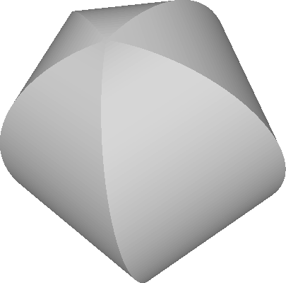
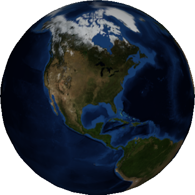
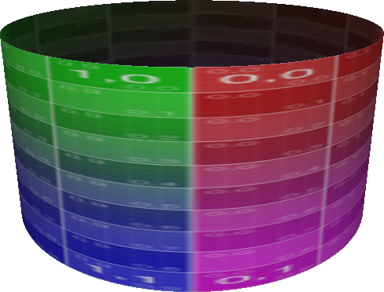
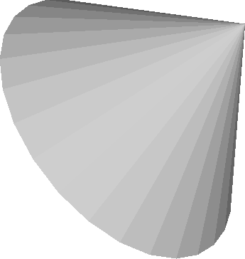
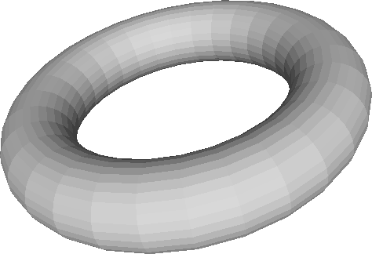
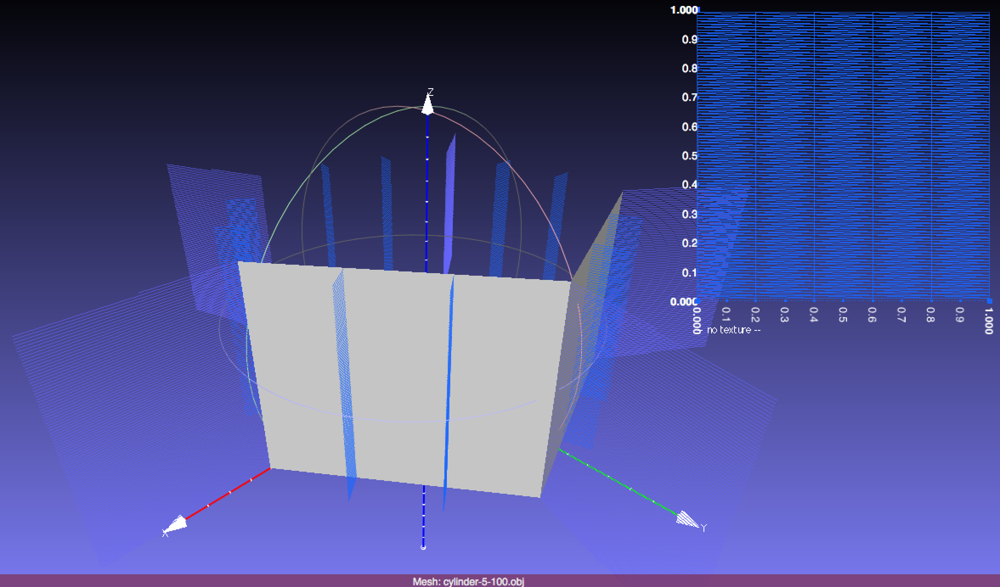
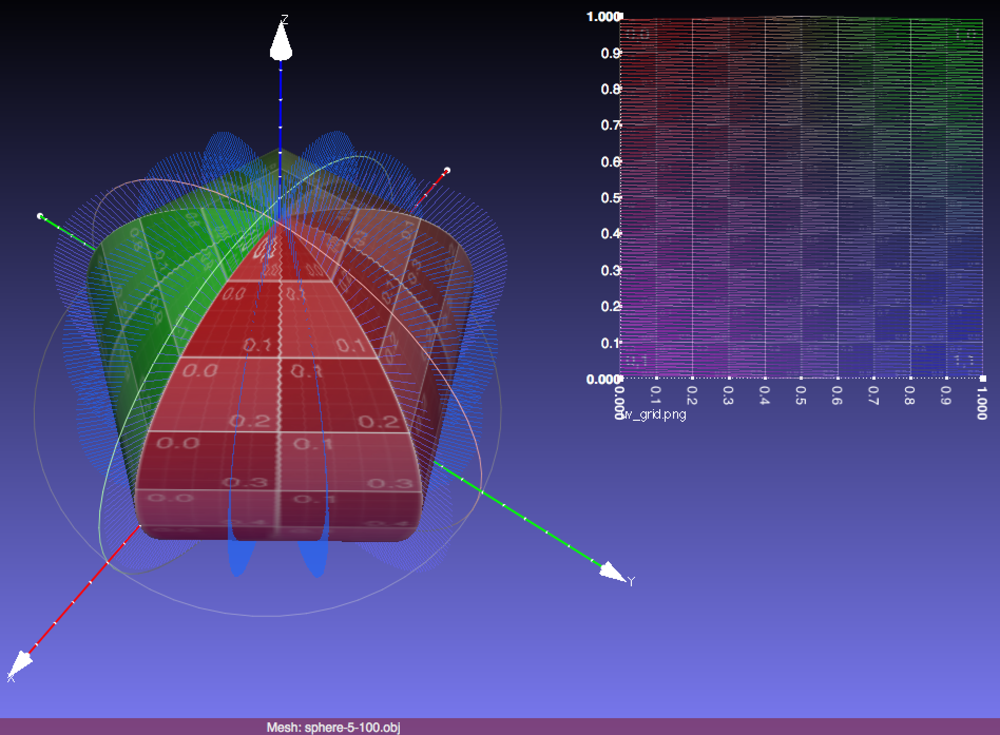

Computer Graphics - Homework Assignment 5 - Meshes
==================================================

Overview:
---------

In this assignment, you will be implementing a bit of mesh processing.
You will tessellate a couple of shapes (cylinder and sphere), which
means that you will create triangle meshes for them. You will compute
the axis-aligned bounding box of a mesh and transform it to the unit
cube. You will implement an algorithm for computing normals for meshes
which don't have them. You will interact with a half-edge data
structure. Your tessellation will create shapes like this:

Goals:
------

* Understand how to create and process triangle meshes.

* Understand how to tessellate surfaces, including position, normal, and
texture coordinates.

* Understand how to compute the bounding box of a mesh.

* Increase familiarity with transformation matrices.

* Understand how to compute normals from a mesh with only surface
positions.

* Understand how to work with a half-edge data structure.

* Become more comfortable with C++.

Background
---------

* Book (FoCG,4e): Chapter 12.1 *Triangle Meshes*.
* Video: "Lecture 11: Geometry Processing" and "Assignment 5: Meshes"
* Quiz: Mesh Processing

(FoCG,4e is *Fundamentals of Computer Graphics (4th edition)* by Steve Marschner and Peter Shirley, 4th edition.)

Getting Started & Handing In:
-----------------------------

* Download or clone this code repository. Don't fork it on GitHub, or else your code will be visible to everyone.

* Follow the instructions to install a working development environment: <https://github.com/yig/graphics101> . You do not need to install Qt or any other external libraries for this assignment.

* The program is a command line program. The code for this
project makes use of only the C++ standard library and `glm`,
a library which provides the [vector and matrix data types from the OpenGL Shading Language (GLSL)](https://www.khronos.org/opengl/wiki/Data_Type_(GLSL)).

* You are encouraged to write helper functions as you like.

* Build and run the code. The code should compile, but it will complain
when running about not having enough arguments. You should see a message
like:

        Usage: ./meshes cylinder #slices #stacks output.obj
        Usage: ./meshes sphere   #slices #stacks output.obj
        Usage: ./meshes cone     #slices #stacks output.obj
        Usage: ./meshes torus    #slices_big_circle #slices_small_circle tube_radius output.obj
        Usage: ./meshes cube     #slices_edge output.obj
        
        Usage: ./meshes normals          weights input.obj output.obj (weights must be either 'unweighted' or 'angle_weighted')
        Usage: ./meshes normals_halfedge weights input.obj output.obj (weights must be either 'unweighted' or 'angle_weighted')
        
        Usage: ./meshes normalize input.obj output.obj
        
        Usage: ./meshes transform M11 M21 M31 M41 M12 M22 M32 M42 M13 M23 M33 M43 M14 M24 M34 M44 input.obj output.obj (Mij are the elements of a 4x4 matrix)

* Add your code to `mesh.cpp`, `shape.cpp`, and `halfedge.cpp`. You may add
helper functions if you wish.

* Build and run and test that it is working correctly. Qt Creator has a
great debugger.

* Check your work with the command line tests by running `ctest --verbose`. This will test whether the following functions are working correctly:
    * `computeNormals()`
    * `computeNormalsHalfEdge()`
    * `normalizingTransformation()`
    * `applyTransformation()`
    * `Cylinder::tessellate()` (partial coverage; doesn't test whether triangles connect the right vertices)
    * `Sphere::tessellate()` (partial coverage; doesn't test whether triangles connect the right vertices)

* Run the following commands. Copy your output `.obj` files into a new
output subdirectory named `output`. You can do this automatically by running the CMake target `output` via `make output` or `cmake --build . --target output`.

        ./meshes cylinder 5 10 cylinder-5-10.obj
        ./meshes cylinder 30 2 cylinder-30-2.obj
        ./meshes cylinder 3 2 cylinder-3-2.obj
        ./meshes sphere 5 30 sphere-5-30.obj
        ./meshes sphere 30 30 sphere-30-30.obj
        ./meshes sphere 3 1 sphere-3-1.obj
        ./meshes normals unweighted cube_binary.obj cube_binary-unweighted.obj
        ./meshes normals_halfedge unweighted cube_binary.obj cube_binary-unweighted-halfedge.obj
        ./meshes normals unweighted bunny.obj bunny-unweighted.obj
        ./meshes normals_halfedge unweighted bunny.obj bunny-unweighted-halfedge.obj
        ./meshes normals unweighted cylinder_irregular.obj cylinder_irregular-unweighted.obj
        ./meshes normals_halfedge unweighted cylinder_irregular.obj cylinder_irregular-unweighted-halfedge.obj
        ./meshes normalize bunny.obj bunny-normalize.obj
        ./meshes transform 0 0 1 0 0 1 0 0 -.1 0 0 0 0 0 0 1 cylinder-30-2.obj cylinder-30-2-transform-yzsquash.obj

    The following are bonus:

        ./meshes cone 5 10 cone-5-10.obj
        ./meshes cone 30 1 cone-30-1.obj
        ./meshes cone 3 1 cone-3-1.obj
        ./meshes torus 5 10 .25 torus-5-10-.25.obj
        ./meshes torus 20 3 .1 torus-20-3-.1.obj
        ./meshes torus 3 3 .25 torus-3-3-.25.obj
        ./meshes cube 2 cube-2.obj
        ./meshes cube 10 cube-10.obj
        ./meshes normals angle_weighted cube_binary.obj cube_binary-angle_weighted.obj
        ./meshes normals_halfedge angle_weighted cube_binary.obj cube_binary-angle_weighted-halfedge.obj
        ./meshes normals angle_weighted bunny.obj bunny-angle_weighted.obj
        ./meshes normals_halfedge angle_weighted bunny.obj bunny-angle_weighted-halfedge.obj
        ./meshes normals angle_weighted cylinder_irregular.obj cylinder_irregular-angle_weighted.obj
        ./meshes normals_halfedge angle_weighted cylinder_irregular.obj cylinder_irregular-angle_weighted-halfedge.obj

* You are encouraged to share blooper images you create while implementing the assignment on Piazza.

* Create a file named `Notes.txt` in the folder. Describe any known issues or extra features. Name people in the class who deserve a star for
helping you (not by giving your their code!).

* When done, zip your entire `meshes` directory, your `Notes.txt` file,
and your `output` directory as `meshes.zip`.
There is a target named `zip` that will do this for you (`cmake --build . --target zip`)
or you can use the `cpack` command from inside your build directory.
The `zip` target will automatically run the `output` target, whereas you must
manually run the `output` target if using `cpack`.
If you create the zip file manually,
do not include your `build` directory or the `examples` directory.
They are large and unnecessary.
Upload your solution to Blackboard before the deadline.

* **THIS IS AN INDIVIDUAL, NOT A GROUP ASSIGNMENT. That means all code
written for this assignment should be original! Although you are
permitted to consult with each other while working on this assignment,
code that is substantially the same will be considered cheating.** In your
`Notes.txt`, please note who deserves a star (who helped you with the
assignment).

Rubric:
-------

* **(60 points)** Tessellation. Create a triangle mesh for a shape,
including positions, normals, and (optionally) texture coordinates. Your
code goes in `shape.cpp`. The function signature is

        void Shape::tessellate( Mesh& mesh_out );

    For each type of shape, you will fill out the `Mesh` object passed
    into the function. Its properties are:

    * **(20 points)**  
    `mesh.positions`: the array of 3D positions  
    `mesh.face_positions`: the array of triangles indexing `mesh.positions`

    * **(10 points)**  
    `mesh.normals`: the array of 3D normals  
    `mesh.face_normals`: the array of triangles indexing `mesh.normals`

    * **(bonus 10 points)**  
    `mesh.texcoords`: the array of 2D texture coordinates (aka explicit
coordinates). Texture coordinates range from [0,1] in each dimension
and are used to look up values in an image as a fraction of the image
width and height.  
    `mesh.face_texcoords`: the array of triangles indexing `mesh.texcoords`

    The shapes are:

    * Cylinder. The cylinder axis runs along the z-axis, from (0,0,0) to
(0,0,1). The cylinder has radius 1. The cylinder has no top or bottom
cap. The first texture coordinate runs around the circle of the cylinder
and is equal to the angle as a fraction of 2π. The second texture
coordinate runs up the cylinder. It is equal to z.
There are two member variables available to the function, `int m_slices`
and `int m_stacks`. Your cylinder should have `m_slices` vertices around
the circle (so three is the minimum) and `m_stacks` vertices along the
axis (so two is the minimum). There will be a total of
`m_slices*m_stacks` positions, `m_slices` normals (since each stack has
the same normals), and `(m_slices+1)*m_stacks` texture coordinates
(since the last texture coordinate of each circle must be
2π/2π = 1 and so can't be 0 like the first or else the texture
would tear).

    * Sphere. The sphere is the unit circle centered at the origin (0,0,0)
with radius 1. The first texture coordinate should be the longitude
angle as a fraction of 2π. The second texture coordinate should be
the latitude angle as a fraction of π. There are two member
variables available to the function, `int m_slices` and `int m_stacks`.
Your sphere should have `m_slices` lines of longitude (so three is the
minimum) and `m_stacks` lines of latitude (not counting the north and
south poles, so 1 is the minimum). There will be a total of
`m_slices*m_stacks + 2` positions (the +2 comes from the north and
south pole), the same number of normals as positions, and
`(m_slices+1)*m_stacks + 2` texture coordinates (for the same reason as
the cylinder, +2 for the north and south poles).

    * **(bonus, quarter credit)** Cone. The cone whose axis runs from (0,0,0) to
(0,0,1) with radius 1. The cone has no bottom cap. The first texture
coordinates runs around the circle of the cone. The second texture
coordinate runs up the cone. It is equal to z.
There are two member variables available to the function, `int m_slices`
and `int m_stacks`. Your cone should have `m_slices` vertices around the
circle (three is the minimum) and `m_stacks` vertices along the axis (not
counting the top point, so 1 is the minimum). There will be a total of
`m_slices*m_stacks + 1` positions (the +1 is the top point), `m_slices`
normals (since each stack has the same normals), and
`(m_slices+1)*m_stacks + 1` texture coordinates (for the same reason as
the cylinder and sphere, +1 for the top point).

    * **(bonus, quarter credit)** Torus. A torus is a donut. For our "unit"
torus, the center of the doughy tube is the unit circle in the xy plane
with radius 1. If you cut into the tube of the donut, you will cut
through a circular cross section. The cross section has radius
`m_cross_radius`. You can think of it as if dough with constant
thickness `m_cross_radius` was added to the unit circle in the xy plane.
The first texture coordinate runs around each cross section circle. The
second texture coordinate runs around the tube.
There are three member variables. `real m_cross_radius` was already
mentioned. The other two are `int m_slices_tube_circle` and
`int m_slices_cross_circle`. Your torus should have
`m_slices_cross_circle` vertices around each cross-section of the tube,
and `m_slices_tube_circle` vertices around the entire tube. (Three is
the minimum for each.) There will be a total of
`m_slices_tube_circle*m_slices_cross_circle` positions and normals,
and `(m_slices+1)*(m_stacks+1)` texture coordinates (since the last
texture coordinate of each circle, tube and cross section, must be
2π/2π = 1 and so can't be 0 like the first or else the texture
would tear).

    * **(bonus, quarter credit)** Cube. A unit cube whose sides are axis-aligned
and whose corners are (-1,-1,-1) and (1,1,1). Each square face should
have the entire texture mapped onto it. There is a single member
variable, `int m_slices_edge`. Each edge of your cube should have
`m_slices_edge` vertices (so two is the minimum), and each face of your
cube should have `m_slices_edge*m_slices_edge` vertices. There will
be a total of `(m_slices_edge-2)*(m_slices_edge-2)*6 + (m_slices_edge-2)*12 + 8`
positions (since each edge is shared by two
faces, and each corner is shared by three faces). There will be a total
of 6 normals (one per face). There will be a total of
`m_slices_edge*m_slices_edge` texture coordinates.

* **(30 points total)** Mesh normals. Your code goes in `mesh.cpp` and (a tiny
bit) `halfedge.cpp`. Given a Mesh object with positions but no normals,
compute a normal for each position by averaging the (flat) normal of
each triangle touching the vertex. You can do this by initializing a
running tally of the average normal for each vertex. Each triangle uses
its positions to compute a normal via the cross product. Add this normal
to the running tally for the vertex. If the strategy parameter is `Unweighted`,
simply normalize the normal before adding it to the running tally. For bonus,
if the strategy parameter is `AngleWeighted`, normalize the normal and then scale
it by the angle of the triangle at the vertex before adding it to the running tally.

    * **(10 points)** Without a half-edge data structure. Iterate over each
triangle. Add its unweighted normal to the running
tally for each of its three vertices. The function signature is:

            void Mesh::computeNormals( MeshNormalStrategy strategy )

        * **(bonus 5 points)** Add each triangle's `AngleWeighted` normal to the running tally.

    * **(20 points)** With a half-edge data structure. Iterate over each
vertex. Call `halfedges.vertex_face_neighbors( vertex_index )` to
obtain the triangles touching a vertex as a vector of indices into
`.face_positions`. Then iterate over the triangles and add their
unweighted normals to the running tally for the vertex.
The function signature is:

            void Mesh::computeNormalsHalfEdge( MeshNormalStrategy strategy )

        Note that the half-edge function `.vertex_face_neighbors()` is not
written for you. You must fill in the code for this function in
`halfedge.cpp`. It is a very short function. Follow the provided outline.
Consult `HalfEdgeTriMesh::vertex_vertex_neighbors()` for reference; it
differs from `.vertex_face_neighbors()` by exactly one line.

        * **(bonus 5 points)** Add each triangle's `AngleWeighted` normal to the running tally.

* **(10 points)** Mesh normalization. Your code goes in `mesh.cpp`.

    * Compute the 4x4 transformation matrix that, if applied to the .positions
of the mesh, translates and uniformly scales it to tightly fit within
the unit cube. The unit cube is the cube with axis-aligned faces
centered at the origin with side length 2, aka corners at (-1,-1,-1) and
(1,1,1). The function signature is:

            mat4 Mesh::normalizingTransformation() const

        `normalizingTransformation()` does not affect any vertex positions. (That
is `applyTransformation()`, described below.) You can break down the job
of `normalizingTransformation()` into two parts:

        1. Compute the axis-aligned bounding box for all positions in the mesh. To
do this, find the minimum and maximum x, the minimum and maximum y, and
the minimum and maximum z among all positions in the mesh. The minimum
x,y,z is one corner of the bounding box and the maximum x,y,z is the
other corner.

        2. Compute the transformation that translates this bounding box to be
centered at the origin. (Hint: The center of the bounding box is 0.5*(
min_xyz + max_xyz ).) Compute the transformation that uniformly scales
the bounding box to fit inside the [-1,1] cube, which has edge length 2.
(Hint: max_xyz - min_xyz is the size of the bounding box in all
three dimensions. Scale so that the maximum size in any dimension equals
2.) If your translation matrix is T and your scale matrix is S and a
vertex is v, the transformation you want to apply is S * T * v, which
means that the box will first be centered at the origin and then scaled
so that its maximum dimension exactly fits within [-1,1].

    * You must also write a function which applies a transformation matrix to
the mesh. You apply the transformation matrix itself to .positions.
Don't forget that you apply the inverse transpose of the upper-left 3x3
portion of the matrix to the normals. The function signature is:

            void Mesh::applyTransformation( const mat4& transform )

Tips
----

* There is some relevant pseudocode in the `docs` directory. Consider that a cylinder, sphere, cone, and torus are all rectangles rolled up in different ways, with one edge glued (two in the case of the torus) and possible a north or south pole attached.

    * The `make_mesh_grid()` pseudocode is an example showing you how to create a square out of triangles, where the number of triangles can be specified by the user. The square is a 2D square in the x,y plane, so all vertices have z=0. This pseudocode should help you understand how to create a mesh, but it is a simpler scenario that what you have to do in this project in two major ways.
        * One difference is that you can make a square without defining a separate explicit coordinate system for the shape, like latitude and longitude for spherical coordinates or theta and z for cylindrical coordinates. That's because x,y coordinates parameterize (or walk along) both the square and the output positions simultaneously. In the general case, you iterate over the explicit coordinates (e.g. spherical or cylindrical) and use a formula to convert from, say, latitude and longitude to x,y,z coordinates. Slices and stacks tell you how many times to iterate along the two explicit dimensions (e.g. latitude and longitude). For a cylinder, you can think of this as rolling the square into a tube.
        * The second difference is that a sphere and a cylinder are watertight shapes. You will need to create faces between the last and first slice. For the sphere, you will also need to create an extra vertex at the top and bottom (the north and south poles) and then faces to glue the top and bottom stacks to those vertices.

You need to fill our `mesh.normals` when tessellating these shapes. The `computeNormals()` function is for arbitrary triangle meshes you load which don't already have normals. When tessellating, you know the shape and so you have a formula for the correct normal at each position. This is better than computing the normal at each face or by averaging face normals.

* For debugging an OBJ that you program saves, I highly recommend the free
program [meshLab](http://www.meshlab.net/) ([http://www.meshlab.net/](http://www.meshlab.net/)):

    
    

    * A visualization like the above tells you a lot about your mesh. With a
few viewer settings, you can see the UV coordinates. You can see the
x,y,z axes and tell that the mesh is running along +z. You can see the
normals (face and vertex). You can see that the faces have
counter-clockwise orientation because "back-faces culling" is on and the
back-faces are missing. To create a similar visualization, open your OBJ
file with meshLab and then, under the Render menu, choose:

        * Show Normal/Curvature
        * Show Axis
        * Show UV Tex Param
        * Render Mode > BackFace Culling

    * To load a texture, like `uv_grid.png` or `earth.png`, go to Filters >
Texture > Set Texture.

    * To debug normals, it can be helpful to view with mesh with "reflection
lines", which renders the mesh as if it were a mirror in a long, striped
corridor. In meshLab, choose "Render > Render Mode > Smooth" and
choose "Render > Shaders > reflexion_lines".

* A cylindrical coordinate system is *(r,φ,z)*, where *r* is the
radius, *φ* is the angle around the circle of the cylinder, and
*z* is the cartesian *z* coordinate. For your cylinder, *r* = 1, slices
evenly sample *φ*, and stacks evenly sample *z*.

    * To convert cylindrical coordinates to Cartesian coordinates for your
positions:  
    *x = r cos( φ )*, *y = r sin( φ )*, and *z* = *z*.

    * A cylinder's normal at a position has the same *x,y* as the position, but *z* = 0.

    * A cylinder's texture coordinates are: *( φ/(2π), z )*.

* A spherical coordinate system is *(r,θ,φ)*, where *r* is the
radius, *θ* ∈ [0,π] is the angle away from the
north pole (like latitude), and *φ* ∈ [0,2π] is
the angle around the sphere like longitude. For your sphere, *r* = 1,
slices evenly sample *φ*, and stacks evenly sample *θ*.

    * To convert spherical coordinates to Cartesian coordinates for your
positions: *x = r sin(θ) cos(φ)*, *y = r sin(θ) sin(φ)*,
and *z = r cos(θ)*.

    * A sphere's normal at a position has the same *x,y,z* as the position.

    * A sphere's texture coordinates are
( φ/(2π), 1 - θ/π ).

* For a torus, a convenient coordinate system is 2D polar coordinates
*(r,θ)* along with a cartesian *z* coordinate. In this way, the
formula for a torus given *u,v* parameters is
*(r,θ,z) = ( 1 + p cos( 2 π u ), 2πv, - p sin( 2 π u ) )*,
where *p* = `m_cross_radius`. The *u,v* parameters go from 0 to 1
around the cross-section and tube, respectively. You can convert the 2D
polar coordinates to 2D cartesian coordinates as *x = r cos(θ)* and
*y = r sin(θ)*. The normal is the position after translating the
center of the cross section to the origin, which means subtracting 1
from *r*. To get a unit normal, drop the *p* scale factor. (You can verify
that it is unit by making use of the identity
*cos²(θ) + sin²(θ) = 1*.)

* When writing `Mesh::normalizingTransformation()`, you can use
`glm::translate(mat4(1.0), vec3(x,y,z))` to get a translation matrix that
translates by *x,y,z*. You can use `glm::scale(mat4(1.0), vec3(s,s,s))` to
get a scale matrix that scales uniformly by *s*. You can also build
these matrices yourself quite easily:

    * A uniform scale matrix is a matrix whose diagonal is the value to scale
by. You can create a 3x3 uniform scale matrix via `mat3( scale_factor )`,
where `scale_factor` is a number. You can create a `mat4` from a `mat3 m` via
the constructor `mat4(m)`. You can create an identity `mat4` via `mat4(1.0)`.
You can create a translation matrix by setting the fourth column of an
identity `mat4 t` via `t[3] = vec4( x,y,z,1.0 )` or, equivalently,
`t[3] = vec4( p,1.0 )`, where `p` is a `vec3`.

* The `glm` math library has many useful functions. It implements the [vector and matrix data types from the OpenGL Shading Language (GLSL)](https://www.khronos.org/opengl/wiki/Data_Type_(GLSL)).
In other projects, you've used it to `normalize()` a vector and compute the `dot()` product between two vectors. You can also use it to compute the `cross()` product of two vectors.

* `glm::min()` and `glm::max()` operate component-wise. That means that
`glm::min( vec2( 5.0, -3.0, vec2( 1.0, 0.0 ) )` is `vec2( 1.0, -3.0 )`. This
is useful for computing the axis-aligned bounding box of a set of
points, which is what you need to do in
`Mesh::normalizingTransformation()`.

* When computing angle weighted normals, you need to compute the angle at
each corner of the triangle. Recall that the dot product of two vectors
**a** · **b** = cos(θ) ||**a**|| ||**b**||,
where θ is the angle between them. So you can obtain the angle
between two vectors via the inverse cosine (arccosine) of the normalized
vectors. The function that computes arccosine is `acos()`. Call it on the
dot product of two of the triangle's edges, normalized. Note that `acos()`
is very strict about its input being between -1 and 1. Due to floating
point issues, sometimes the dot product will produce a number epsilon
out of range. Use `glm::clamp()` or `min()` and `max()` to ensure the value you
pass to acos() is between -1 and 1.

* You can access the constant pi aka π = 3.14... via the constant `pi`
(defined in the `#include "types.h"` header) or by calling `glm::pi()`.
